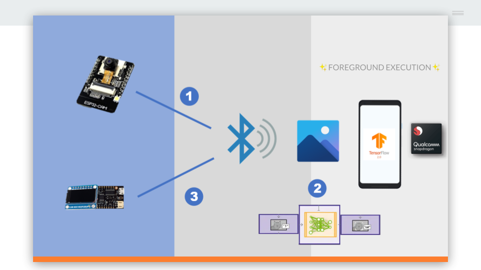
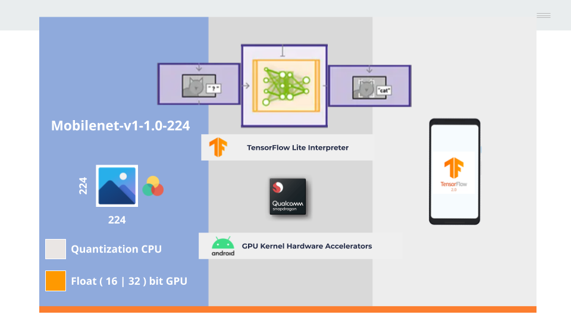
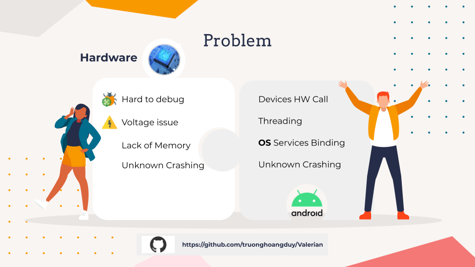
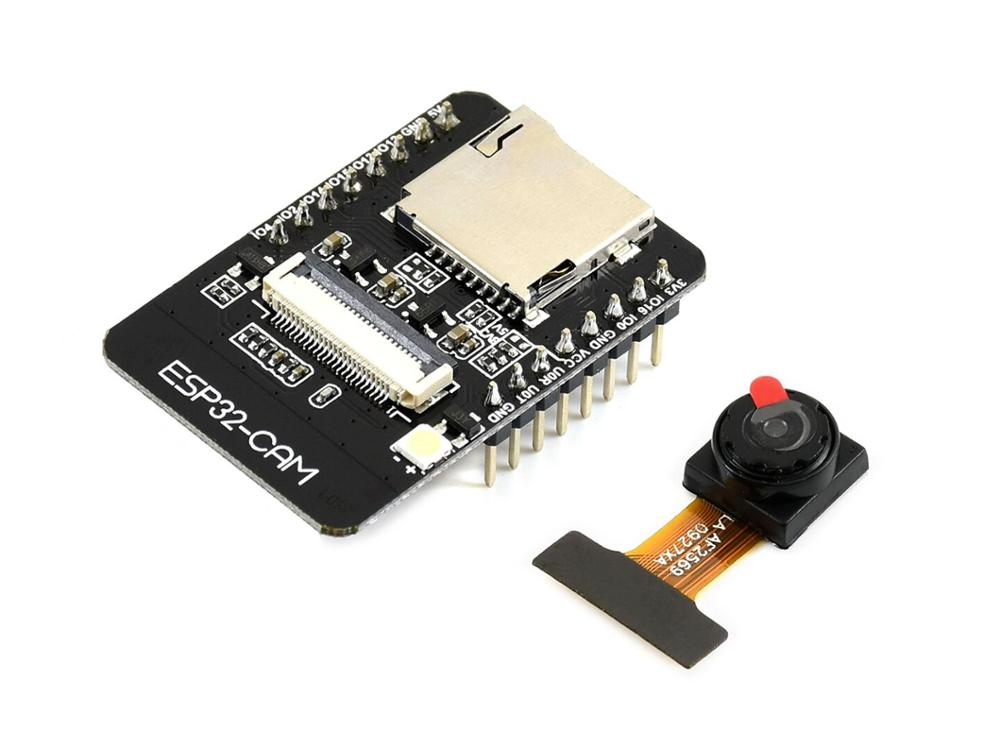
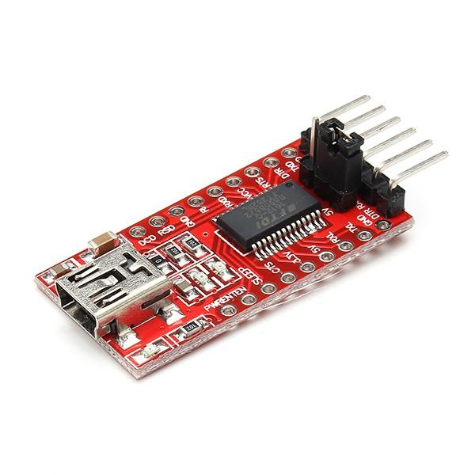
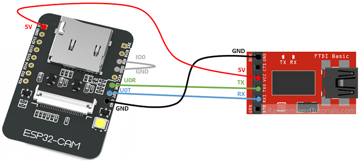

# Valerian 
Valerian is a smart glass project a lite prototype to bringing idea to Low price devices support for the blind
Current stack of the project will follow
  - Image Recognition
  - Related Information about the object
  - Notification ( How phone can notify it BLE watch ? )

### Flutter
This project is already cracking the potential of Flutter working with the native stack.
Stuff that i'm impress with Flutter.
Platfrom channel, Control assest path with native platfrom.

### Tech
* [Flutter](https://flutter.dev) - for mobile development
* [Arduino](http://arduino.cc) - IoT framework
* [Espressif](https://docs.espressif.com/projects/esp-idf/en/latest/esp32/) - IoT framework

### True story
This project will not run with IOS device because IOS doesn’t play nice with Bluetooth Classic (SPP Mode) it seen require some [MFI](https://mfi.apple.com/) cretify with the cost of a 🚗 so ridiculous. And why not BLE for cross platfrom support, Here why BLE sending JPEG buffer is kinda messy and took extreme time tranfer BLE are not design for it. BLE is design for lightweight messages like notification, sensor data (few bytes i guess) with a ton off support for GATT Profile for describe the services in the BLE device, as i doing this project BLE is at the version of 4.0 current for 2021 we are having BLE 5.0 having much more speed (looking forward to using BLE over SPP for cross-platfrom supportive).

Well I took a shot for Bluetooth Classic (SPP Mode) Android the result sending the jpeg it blazing fast.

I really want to took a big cracker on the Flutter and learning about the Android Stack (Linux). So I put the **(Bluetooth Classic, Tensorflow, SMS Notification)** => In the Foreground runner of Android --- And then using Flutter calling the **method channel** to wake up Foreground running my things.

*----------------------------*

A bit high cracker here and there if you guys wanna chat about it, feel free to issue me or just hook me up in voice calling for questioning ideaer and Icebreaker

*----------------------------*

### Data Flow

  

### Model Spec

  

### Limitation

  

### Hardware
ESP32|FTDI
|---|---|
 | 

### Connection Diagram

  

